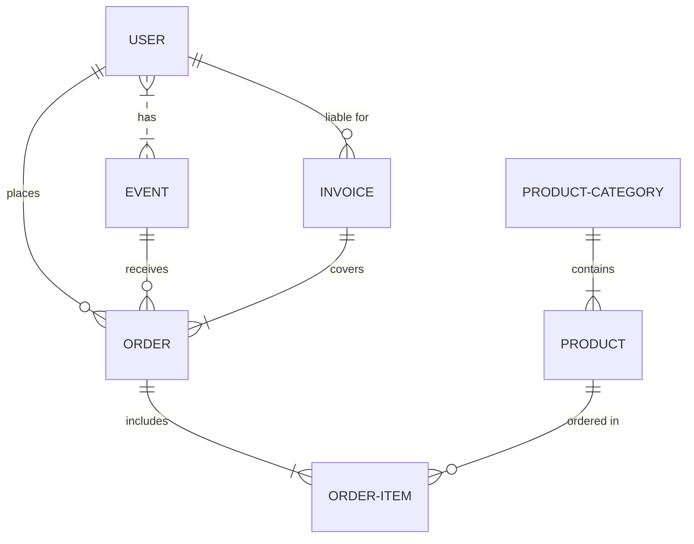

# Entity relation diagram

```mermaid 
erDiagram
          USER }|..|{ EVENT : has
          USER ||--o{ ORDER : places
          USER ||--o{ INVOICE : "liable for"
          EVENT ||--o{ ORDER : receives
          INVOICE ||--|{ ORDER : covers
          ORDER ||--|{ ORDER-ITEM : includes
          PRODUCT-CATEGORY ||--|{ PRODUCT : contains
          PRODUCT ||--o{ ORDER-ITEM : "ordered in"
```